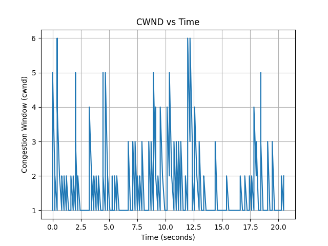
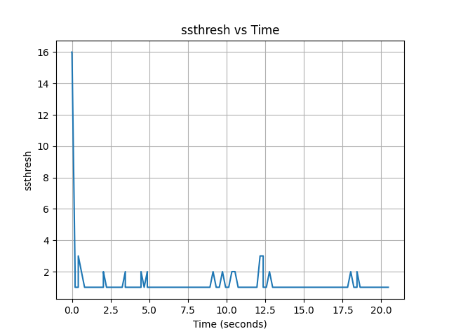
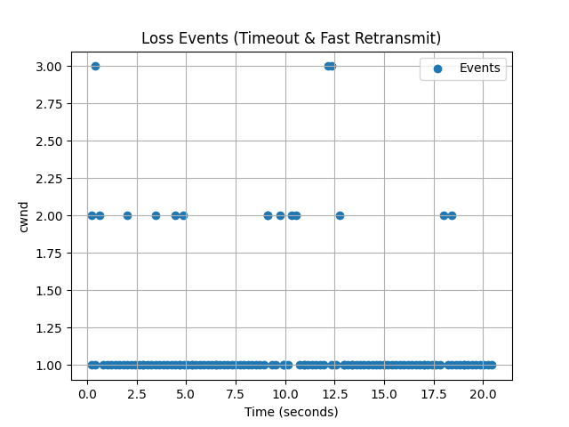

# 🚀 Reliable File Transfer Protocol (RFTP)

A custom **TCP-like reliable transport protocol built over UDP**, implementing reliability, congestion control, and performance benchmarking.

---

## 📌 Overview

RFTP is a user-space transport protocol designed to provide:

- Reliable data delivery over UDP
- Efficient handling of packet loss
- Adaptive transmission using congestion control
- Performance benchmarking under different network conditions

The protocol mimics core TCP behaviors while remaining lightweight and fully customizable.

---

## ⚙️ Features

### 🔹 Reliability
- Sequence numbers
- Acknowledgments (ACK)
- Retransmission on loss

### 🔹 Advanced Transport Mechanisms
- Selective Repeat ARQ
- Fast Retransmit (duplicate ACK detection)
- Sliding Window Protocol

### 🔹 Congestion Control
- Slow Start
- Congestion Avoidance (AIMD)
- Dynamic congestion window (cwnd)
- Threshold (ssthresh) adjustment

### 🔹 Adaptive Timeout
- RTT-based timeout estimation
- Prevents unnecessary retransmissions
- Improves stability under varying network conditions

### 🔹 File Transfer
- Chunk-based file transmission
- In-order reconstruction at receiver
- FIN-based connection termination

### 🔹 Benchmarking & Metrics
- Throughput
- Retransmissions
- Efficiency
- Transfer time

---

## 🧱 Architecture

    Client → Transport Layer → UDP → Server

### Components

    packet/     → Packet structure & serialization
    file/       → FileChunker & FileAssembler
    client/     → Sender logic
    server/     → Receiver logic
    utils/      → Configurations

---

## 📦 Packet Structure

    | Version | Type | Sequence Number | Length | Payload |

### Packet Types
- DATA → file data
- ACK → acknowledgment
- FIN → end of transmission

---

## 🔄 Protocol Workflow

1. Client reads file in chunks
2. Sends packets using sliding window
3. Server buffers out-of-order packets (Selective Repeat)
4. ACKs indicate next expected sequence
5. Client retransmits missing packets
6. Congestion control adapts sending rate
7. FIN packet signals completion

---

## 📊 Benchmark Results

### Average Performance

| Loss | Time (ms) | Throughput (pkt/s) | Retries | Fast Retx | Total Pkts | Efficiency |
|------|----------|--------------------|--------|-----------|------------|------------|
| 0.0  | 16       | 12282              | 0      | 0         | 196        | 100%       |
| 0.1  | 1318     | 154                | 6      | 16        | 236        | 83.1%      |
| 0.3  | 7393     | 26.75              | 36     | 22        | 349        | 56.8%      |
| 0.5  | 21476    | 9.01               | 108    | 20        | 530        | 37.7%      |

---

## 📊 RFTP vs TCP Comparison

| Protocol | Loss | Time (ms) | Throughput | Retries | Efficiency |
|---------|------|----------|-----------|--------|-----------|
| RFTP    | 0.0  | 16       | 12282 pkt/s | 0      | 100% |
| RFTP    | 0.1  | 1318     | 154 pkt/s   | 6      | 83.1% |
| RFTP    | 0.3  | 7393     | 26.75 pkt/s | 36     | 56.8% |
| RFTP    | 0.5  | 21476    | 9.01 pkt/s  | 108    | 37.7% |
| TCP     | 0.0  | 9 ms     | ~21 MB/s    | 0      | ~100% |

## 🔍 RFTP vs TCP Analysis

- TCP achieves significantly higher throughput (~21 MB/s) due to kernel-level optimizations and zero-copy buffering.
- RFTP operates in user space, introducing overhead from manual packet handling and retransmissions.
- Under packet loss, RFTP demonstrates robustness and graceful degradation, while TCP internally handles loss using advanced algorithms (Cubic/BBR).
- RFTP exposes transport-layer mechanisms (congestion control, retransmission, RTT estimation), providing deeper insight into protocol behavior.
- While TCP is optimized for performance, RFTP is valuable for understanding and experimenting with transport-layer design.

## 📈 Key Observations

- Performance degrades gracefully with increasing packet loss  
- Fast retransmit handles most losses at low/moderate levels  
- Timeouts dominate under heavy loss (50%)  
- Selective Repeat reduces redundant retransmissions  
- Congestion control stabilizes throughput  

---

## ▶️ How to Run

### 1. Start Server

    java -cp target/classes com.rftp.server.Server

### 2. Run Client

    java -cp target/classes com.rftp.client.Client

---

## ⚙️ Configuration

Modify `Config.java`:

    LOSS_PROBABILITY = 0.3
    WINDOW_SIZE = 5
    CHUNK_SIZE = 1024
    TIMEOUT_MS = 200

---

## 🧪 Experiments

The protocol was tested under varying packet loss conditions:

    0%, 10%, 30%, 50%

Each test was run multiple times and averaged.

---

## 📈 Congestion Control Visualization

## 🔮 Future Improvements

- TCP Cubic / BBR congestion control  
- Selective ACK (SACK)  
- Checksum for data integrity  
- Multi-threaded receiver  
- Visualization of cwnd vs time  

---

## 🧠 Learnings

- Transport layer protocol design  
- Reliability vs performance trade-offs  
- Congestion control behavior  
- Impact of packet loss on throughput  

---

## 🏆 Summary

RFTP replicates core TCP mechanisms:

- Reliable delivery  
- Efficient retransmission  
- Congestion-aware transmission  
- Adaptive timeout handling  

---
