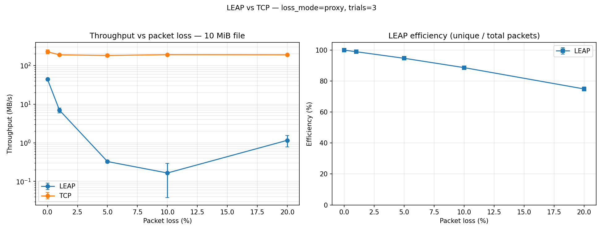

# LEAP — Loss-aware End-to-end Acknowledged Protocol

A TCP-style reliable transport protocol implemented from scratch on top of UDP,
with a CLI, an end-to-end SHA-256 integrity check, and a benchmarking harness
that compares it against TCP under controlled packet loss.

> **LEAP** stands for **L**oss-aware **E**nd-to-end **A**cknowledged
> **P**rotocol — a single jump across a lossy network with retransmits,
> congestion control, and verified delivery.

---

## Status

| Component | State |
|---|---|
| Reliable transport (sliding window, fast retransmit, RTO, congestion control) | done, tested at 0%/5%/10% loss on localhost |
| End-to-end SHA-256 integrity | done, verified on every transfer |
| CLI (`leap send` / `leap receive` / `leap benchmark`) | done |
| TCP baseline (`TcpServer` / `TcpClient`) | done |
| Loss-simulation modes (`app`, `proxy`, `kernel`) | implemented; only `proxy` exercised in measurements |
| Benchmark orchestrator + CSV writer | done |
| Plotting script (`plot_benchmark.py`) | done; chart in `docs/benchmark.png` |
| Measured sweep | one run: 10 MiB × {0, 1%, 5%, 10%, 20%} × 3 trials, proxy mode |
| `kernel`-mode (pfctl) measurements | not yet run |
| Unit tests | not yet written |

The numbers in this README are from the single sweep above, recorded with
`MAX_RETRIES = 5`. The default has since been raised to 10 to survive bursty
loss; a re-measurement with the new ceiling is pending.

---

## What this project is

LEAP is **TCP rebuilt in user space** — sequence numbers, cumulative ACKs,
sliding window, fast retransmit, slow start, congestion avoidance, adaptive
RTO, all running over Java `DatagramSocket`s. The point isn't to be faster
than TCP; it's to:

1. Show what every box in the TCP state machine actually does, with real code.
2. Measure it honestly under packet loss, against TCP, with real numbers.

The repository ships with a CLI (`leap send` / `leap receive`), a
benchmark orchestrator that sweeps loss × file-size × trial, three different
loss-simulation modes, and a plotting script that turns the CSV output into a
chart.

---

## Quick start

```bash
# Build (Java 11+, Maven 3.6+)
mvn package

# Send a file
./bin/leap send <file> --to <host:port>

# Receive (in another terminal)
./bin/leap receive --port 4040 --output received/

# Or pass --help to either command for full flag list
./bin/leap send --help
./bin/leap receive --help
```

Example end-to-end transfer:

```bash
./bin/leap receive --port 4040 --output /tmp/in &
./bin/leap send bench_data/test_1m.bin --to localhost:4040
# → Throughput: 15.4 MB/s, Efficiency: 100.0%, integrity verified (sha256=...)
```

---

## Protocol design

### Packet format

```
| version (1B) | type (1B) | seqNum (4B) | payloadLen (4B) | crc32 (4B) | payload |
```

Three packet types: `DATA`, `ACK`, `FIN`. The `FIN` from the client carries
the file's full SHA-256; the server compares its own digest of the assembled
file before acknowledging. Per-packet CRC32 catches in-flight corruption.

### Reliability mechanisms

- Cumulative ACKs (next-expected-byte semantics).
- Sliding window with configurable size (`--window`, default 20).
- Fast retransmit on three duplicate ACKs.
- Adaptive RTO: estimated_RTT + 4 · dev_RTT, capped at 2 s, exponential
  backoff on timeout.
- Selective receiver buffer for out-of-order delivery, in-order flush to disk.
- `MAX_RETRIES = 10` consecutive timeouts on the same window base before the
  client aborts. (TCP has no equivalent ceiling; this is intentional, so a
  truly broken path can't hang forever.)

### Congestion control

TCP-Tahoe-style: slow start → congestion avoidance with AIMD. On loss,
`ssthresh = max(cwnd/2, 4)` and `cwnd = 1`. `ssthresh` floor at 4 prevents
collapse during early-window losses.

### Integrity

Every transfer computes SHA-256 on both ends and the server logs:

```
[OK]  127.0.0.1:54321 — integrity verified (sha256=58acd477...)
```

If the digests disagree, the server logs `[FAIL] integrity mismatch` and the
file is left on disk for inspection.

---

## Repository layout

```
src/main/java/com/leap/
  packet/        Packet wire format and (de)serialization
  file/          FileChunker (sender) and FileAssembler (receiver)
  client/        Client.java — sender + congestion control
  server/        Server.java — multi-session receiver
  benchmark/     TcpServer / TcpClient / Proxy / Benchmark harness
  utils/         Config constants and ChecksumUtils (SHA-256, CRC32)

bin/leap                Shell launcher for the shaded jar
scripts/
  gen_bench_data.sh     Generate 1 / 10 / 100 MiB test files
  loss_up.sh            macOS pfctl/dummynet packet-loss installer
  loss_down.sh          Tear down kernel-level loss
plot_benchmark.py       Render docs/benchmark.png from the CSV
plot_leap.py            Render per-transfer cwnd / ssthresh charts from leap_log.csv
```

---

## Benchmarking

The benchmark sweeps `(loss_rate × file_size × trial)`, runs each cell with
both protocols, and writes one CSV row per transfer.

```bash
# Generate test files (writes to bench_data/, gitignored)
./scripts/gen_bench_data.sh

# Run the default sweep (10 MiB, 5 loss rates, 3 trials, proxy mode)
./bin/leap benchmark --loss-mode proxy --sizes 10m --trials 3 \
    --loss-rates 0,0.01,0.05,0.1,0.2 --protocols leap,tcp

# Plot
python3 plot_benchmark.py
# → writes docs/benchmark.png
```

### Loss-simulation methodology

Honest simulation of packet loss is harder than it looks, so the harness
supports three independent modes and the README is upfront about what each
mode actually models.

| Mode | How loss is applied | Valid for | Requires |
|---|---|---|---|
| `app` | Server drops bytes/datagrams at the application layer | LEAP only | nothing |
| `proxy` | Userspace UDP forwarder drops datagrams at rate `p` | LEAP | nothing |
| `kernel` | macOS `pfctl` + `dummynet` pipe with `plr p` on `lo0` | LEAP **and** TCP | `sudo` |

**Important caveat for TCP:** an app-layer proxy cannot faithfully model TCP
loss — dropping bytes after the kernel has already ACK'd them leaves the
connection wedged. So in `proxy` mode the TCP path is a straight passthrough
and the recorded TCP numbers are essentially "TCP at 0% loss with one extra
hop". Real TCP-under-loss numbers require `kernel` mode:

```bash
sudo ./scripts/loss_up.sh 0.05         # install 5% loss on lo0
./bin/leap benchmark --loss-mode kernel --sizes 10m --trials 3 \
    --loss-rates 0.05 --protocols tcp
sudo ./scripts/loss_down.sh            # tear it down
```

### Measured results — 10 MiB, proxy mode, 3 trials per cell

Run on macOS, loopback, `MAX_RETRIES = 5` (the default at the time of
measurement; current default is 10 — see Status section above):

| Loss rate | LEAP throughput | LEAP retransmits | LEAP efficiency | LEAP integrity | TCP throughput † |
|---:|---:|---:|---:|---:|---:|
| 0%   | 46.2 MB/s | 0    | 100.0% | 3 / 3 | 239 MB/s |
| 1%   |  7.3 MB/s | ~106 |  99.0% | 3 / 3 | 199 MB/s |
| 5%   | 342 KB/s  | ~571 |  94.7% | 3 / 3 | 192 MB/s |
| 10%  |  ~96 KB/s | ~1290|  88.8% | 2 / 3 ‡ | 198 MB/s |
| 20%  | *aborted* | n/a  |   n/a  | 0 / 3 | 195 MB/s |

† TCP via proxy is a passthrough — see the caveat above. The TCP column is
shown for plumbing reference, not as a fair protocol comparison. For honest
TCP-under-loss numbers, run the harness in `kernel` mode (not yet exercised
in this repo's measurements).

‡ One of the three trials at 10% loss tripped the `MAX_RETRIES = 5` ceiling
in use during measurement; the other two completed cleanly. The default
ceiling was subsequently raised to 10 to make this less likely on bursty
loss patterns.

Raw CSV: `docs/benchmark_results.csv`. Chart:



---

## Configuration knobs

`src/main/java/com/leap/utils/Config.java`:

```java
PORT              = 4040    // default UDP port
INITIAL_CWND      = 1       // initial congestion window
SSTHRESH          = 16      // initial slow-start threshold
WINDOW_SIZE       = 5       // default sliding window
TIMEOUT_MS        = 200     // initial socket SO_TIMEOUT
CHUNK_SIZE        = 1024    // payload bytes per packet
DUP_ACK_THRESHOLD = 3       // fast-retransmit trigger
MAX_RETRIES       = 10      // consecutive timeouts before client aborts
HASH_LENGTH       = 32      // SHA-256 digest size
```

CLI flags (`--window`, `--chunk`, `--port`, `--loss`, `--debug`) override the
defaults at runtime.

---

## Limitations and what's intentionally out of scope

- **20% loss is the wall.** With the default retry ceiling, LEAP cannot push
  through 20%+ packet loss; transfers abort by design rather than hang. Raise
  `MAX_RETRIES` if you need to survive worse paths.
- **Single sender → single receiver, single file per session.** No multiplex,
  no resume, no SACK.
- **No encryption, no auth, no NAT traversal.** Localhost / LAN tested only.
- **TCP-vs-LEAP under loss requires `kernel` mode.** The `proxy` mode TCP
  numbers are not a fair head-to-head; that's documented above and in the
  `Proxy.java` class comment, not hidden.

---

## Roadmap

- [x] Reliable transfer with retransmission, sliding window, congestion control
- [x] Adaptive RTO (RFC 6298 style)
- [x] End-to-end SHA-256 integrity
- [x] CLI (`send` / `receive` / `benchmark`)
- [x] Benchmarking harness with three loss-simulation modes (`app`, `proxy`, `kernel`)
- [x] One measured sweep (10 MiB, proxy mode, 5 loss rates × 3 trials)
- [ ] Re-run sweep with `MAX_RETRIES = 10` to update the table above
- [ ] Kernel-mode (`pfctl`) sweep so the TCP-vs-LEAP-under-loss column is real
- [ ] Unit tests (a localhost integrity smoke test at minimum)
- [ ] Selective ACK (SACK) for tighter recovery on bursty loss
- [ ] Resume support (persist last cumulative ACK on both sides)
- [ ] TCP Cubic / BBR-style congestion control behind a `--cc` flag
- [ ] Encryption (libsodium / Noise) for non-loopback use

---

## Building and running from the IDE

```bash
mvn package -DskipTests        # → target/leap.jar
java -jar target/leap.jar send <file> --to localhost:4040
java -jar target/leap.jar receive --port 4040 --output received/
java -jar target/leap.jar benchmark --help
```

The `bin/leap` launcher is a thin wrapper that resolves the jar relative to
its own location, so you can put `bin/` on `PATH` and call `leap` from
anywhere.
